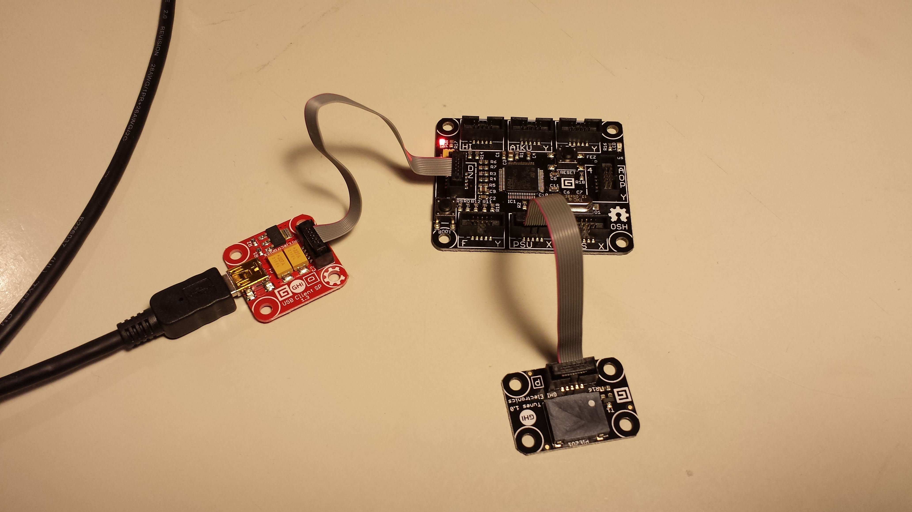

HelloTuneModule
===============

A "Hello world" application with the Tune module and the Fez Cerberus Gadgeteer mainboard.

Requirements
------------

You need to have a [Fez Cerberus Mainboard](https://www.ghielectronics.com/catalog/product/349), a [USB Client SP](https://www.ghielectronics.com/catalog/product/33) and [Tunes module](https://www.ghielectronics.com/catalog/product/434) in order to run the program. 
You also need to set up your software as described on the [.net gadgeteer get started page](http://www.netmf.com/gadgeteer/get-started.aspx).

Hardware setup
--------------

You have to connect the hardware module with the mainboard as it is shown in the `Program.gadgeteer` diagram (This is part of the code.). 

Here is a picture of the hardware setup. 

The result
----------

The viewable result of running the code is that all the LEDs flash one and then the LEDs flash one by one from the first from the right to the last in an endless loop.

I have added a [video of the result]() to youtube.

